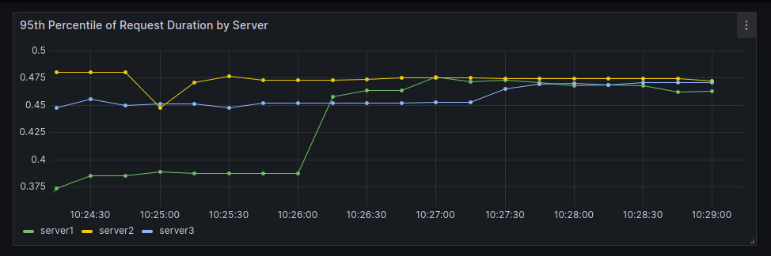

# ewma-policy-poc

This is a playground to test any given coredns policy.

Features:

- test it by number of digs
- test it by time
- it randomly start/stop dns servers
- it randomly change latencies of dns servers
- metrics are exported and can be visualized by either `http://localhost:2112/metrics` endpoint or via Grafana

## disclaimer

I checked out [coredns](https://github.com/coredns/coredns) and removed its `.git` directory. Thus, it is not a submodule of this project.

## prerequisites
- Docker, to run both Grafana and Prometheus

## running it

### with EWMA policy

1. run coredns

```
$ make coredns-latency-policy 
.:8054
CoreDNS-1.10.1
linux/amd64, go1.20.4,
```

2. start Grafana and Prometheus:

```
make obs
```

Grafana will be available in `http://localhost:3000`.

**Running it by number of digs**

Example:

```
make run-by-digs DIGS=1000 RPS=30
```

Where `RPS` stands for the desired requests per second.


**Running it by time**

Example:

```
make run-by-time TIME=600 RPS=30
```

Where `TIME` is the number of seconds and `RPS` stands for the desired requests per second.


## metrics

Available metrics:
- DNS requests over time
- DNS requests over time VS request duration
- Failed DNS requests over time
- Total server starts, per server
- Total server stops, per server
- Request duration (latency), per server

**TODO*: figure out a way of consolidating all dashboads into just one, to see them all at once.

1. in Grafana's home, we have


2. access the dashboards

These are the results by running it for 10 minutes


2.1 DNS requests over time


2.2 DNS requests over time VS request duration


2.3 Failed DNS requests over time


2.4 Total server starts, per server


2.5 Total server stops, per server


2.6 Request duration (latency), per server



### with round-robin policy

1. run coredns

```
$ make coredns-roundrobin-policy
.:8054
CoreDNS-1.10.1
linux/amd64, go1.20.4,
```

The remaining steps are equal from above.

## Makefile available targets

```
$ make help

Usage: make [target]
  help                        shows this help message
  coredns-latency-policy      runs coredns with latency policy
  coredns-roundrobin-policy   runs coredns with round-robin policy
  run-by-time                 runs the tester by a specific time in seconds
  run-by-digs                 runs the tester by number of digs
  obs                         runs both prometheus and grafana
  obs-stop                    stops both prometheus and grafana
```